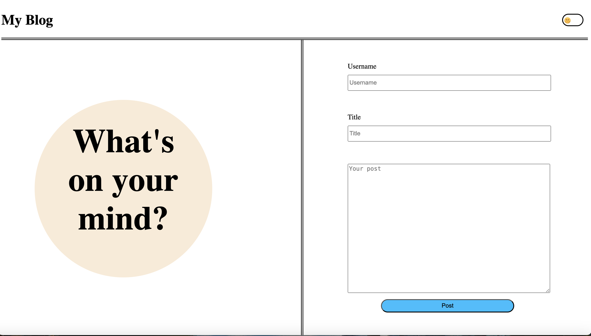
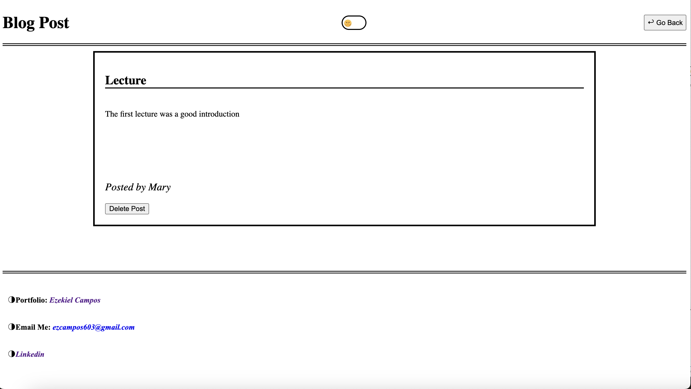

# Challenge 4 UC Berkeley Extension Student Blog Page

## Description
This project is a two page website that allows a user to write and view a post on a blog page.  Using javascript and the DOM each blog post is inputted and stored in the local storage. Event listeners were primarily used to detect when a buttion was clicked for submission. From here the post is rendered by dynamically creating each blog in a box and inserting the data from the local storage.  In addition to the box there is a delete button that will delete the post from the webpage and update the content being held in local storage.  This project was built to practice using the DOM to manipulate, dynamically create, or delete html elements.  

## Installations
No installations used (NPM)

## Usage
This webpage can be used by students to record and share their thoughts and experiences on whatever subject they choose.  The post will continue to exist so that students can go back and review older post, and if they would like to they have the option to delete them.  

### Link
https://ezekielcampos.github.io/challenge-4-personal-blog/index.html

### Screenshot of Main Page

### Screenshot of Blog Page
